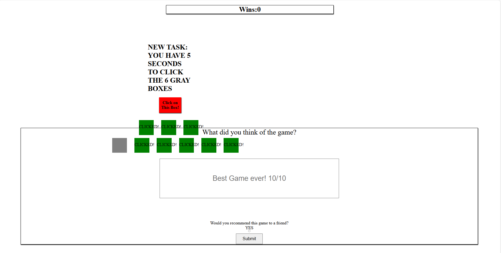

## Functionality
- **Page is compiled fully through index.js, and no HTML or CSS is used**
- A Red Square dances around the screen at random in half the available space in the top half of the screen's full height.
- The square can be clicked, which will trigger a message "You have 5 seconds to click the 3 Blue Squares" and 3 blue squares spawn and branch off of the original red square
- If all 3 red squares are clicked by the end of the 5 second timer, a new message is triggered: "You have 5 seconds to click the 6 Gray squares"
- If all 6 gray squares are clicked by the end of this 5 second timer, the "Wins: 0" label at the top of the screen is incremented by 1

*Note: It was to my understanding styling was not the main focus of this SBA, and I hard-coded dimensions for elements— however I did not notice that I was at 25% zoom so it is recommended that this zoom % is set for ideal viewing. Thank you!*

*Also, I did not see the bottom of the of SBA Requirements stating a form would be necessary, and it was added as a last step— since the webpage is not flexible, at times the square may glitch into the form and cover some text partially.*
